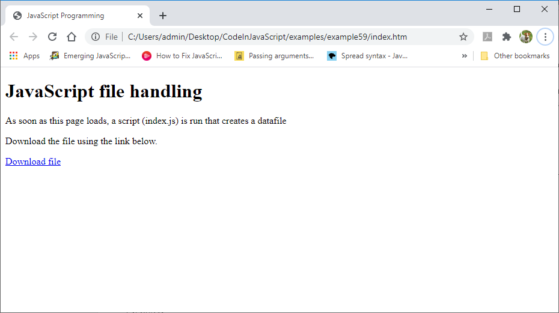

# Demo: Writing data to file
### Background
Unlike many other languages, JavaScript running in a browser is not allowed to open a file unless the user has selected the file manually using an HTML page. This is to prevent malicious web pages having direct access to your computer's file system. So, file handing in JavaScript is quite complicated and combines new HTML web page techniques with new JavaScript file handling techniques. The examples below will show the HTML pages and the JavaScript needed to write to a file.

First, let's look at creating a web page that allows text to be written to a data file.

The page looks like this in a browser 

This is the HTML in the index.html file
```html
<!doctype html>
<html lang="en">
<head>
    <title>JavaScript Programming</title>
</head>
<body>
    <h1>JavaScript file handling</h1>
    <p>As soon as this page loads, a script (script.js) is run that
       creates a datafile</p>
    <p>Download the file using the link below.</p>
    
    <a id="download_link" download="dataFile.txt" href="" >Download file</a>
    <script src="script.js"></script>

    <h3>This doesn't work in a Replit frame<br>
    Use the 'Open in a new tab' button</h3>
</body>
</html>
```
The web page has a few lines of standard HTML and a link to "Download file" whose href is currently blank (=""). The last part of the HTML runs the JavaScript program "script.js". Here's the script.js file
```javascript
var names = ["Paul", "Caroline"];

var data = new Blob(names, {type: 'text/plain'});

var url = window.URL.createObjectURL(data);
document.getElementById('download_link').href = url;
```
The JavaScript has four parts
-	a variable is created to hold an array of strings
-	another variable (data) is created to hold a "Blob" (binary large object) constructed from this array. The type of data in the Blob is described by the second parameter 'text/plain'.
-	A special type of URL (web address) is created that gives the address of this Blob (e.g. blob:null/0781c4a5-4055-4fad-b393-450a62fc1525)
-	The URL is used to fill in the missing part of the download link in the HTML page.

The result of all of this is that when the user clicks on the download link, the contents of the Blob ("Paul""Caroline") is saved as a file (datafile.txt) in the user's download folder.

datafile.txt
```
PaulCaroline
```
Notice that the names don't have any space between them.

### Instructions
- Copy and paste the HTML and JavaScript above into the files index.html and script.js
- Run this repl to see that it actually works!<br>
Note: The download link won't work in the Replit preview frame. Use the 'Open in a new tab' button to run it fullscreen.
- Add some more names into the names array and run again.
- Explore ways to make the names 'comma separated' in the final data file.
- Explore ways to make each name appear on a seperate line in the final data file.


